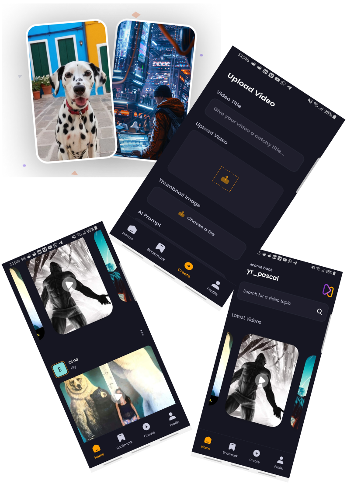

# jm-aora

 <div>
    
    
    
    
    
  </div>

  <div>
  
  </div>

## Dependencies

- npx expo install expo-router react-native-safe-area-context react-native-screens expo-linking expo-constants expo-status-bar

## [Entry](https://youtu.be/ZBCUegTZF7M?si=yFDrgOpYFG1wm0mq)

- npx expo start -c
  Having issues use
- npx expo start --tunnel

### To use [tailwind](https://www.nativewind.dev/quick-starts/expo)

- npm install nativewind
- npm install --save-dev tailwindcss@3.3.2
- read the docs
- npx tailwindcss init

### appwrite andorid package name

com.tyr.aora

- put it in the android/ios app.json object
- To use it with react-native [github](https://github.com/appwrite/sdk-for-react-native)
- npx expo install react-native-appwrite react-native-url-polyfill

# Welcome to your Expo app 👋

This is an [Expo](https://expo.dev) project created with [`create-expo-app`](https://www.npmjs.com/package/create-expo-app).

## Get started

1. Install dependencies

   ```bash
   npm install
   ```

2. Start the app

   ```bash
    npx expo start
   ```

In the output, you'll find options to open the app in a

- [development build](https://docs.expo.dev/develop/development-builds/introduction/)
- [Android emulator](https://docs.expo.dev/workflow/android-studio-emulator/)
- [iOS simulator](https://docs.expo.dev/workflow/ios-simulator/)
- [Expo Go](https://expo.dev/go), a limited sandbox for trying out app development with Expo

You can start developing by editing the files inside the **app** directory. This project uses [file-based routing](https://docs.expo.dev/router/introduction).

## Get a fresh project

When you're ready, run:

```bash
npm run reset-project
```

This command will move the starter code to the **app-example** directory and create a blank **app** directory where you can start developing.

## Learn more

To learn more about developing your project with Expo, look at the following resources:

- [Expo documentation](https://docs.expo.dev/): Learn fundamentals, or go into advanced topics with our [guides](https://docs.expo.dev/guides).
- [Learn Expo tutorial](https://docs.expo.dev/tutorial/introduction/): Follow a step-by-step tutorial where you'll create a project that runs on Android, iOS, and the web.

## Join the community

Join our community of developers creating universal apps.

- [Expo on GitHub](https://github.com/expo/expo): View our open source platform and contribute.
- [Discord community](https://chat.expo.dev): Chat with Expo users and ask questions.
